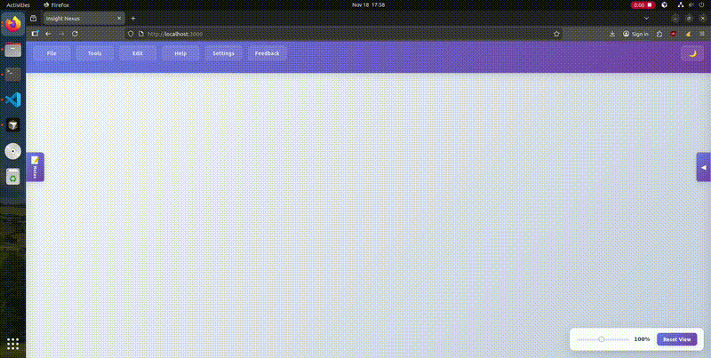

# Insight Nexus - OSINT Investigation Graph Analysis Tool

This local web application allows users to manipulate and connect nodes on their screen to streamline OSINT investigations and information gathering.

# Demo

# Features
## Core Graph Functionality
* Create, edit, and delete nodes on screen
* Connect nodes with edges to show relationships
* Save and load investigation progress
* Undo/redo functionality (Ctrl+Z/Ctrl+Y)
* Box selection with Shift+click
* Manual selection with Ctrl+click
* Sequential node connection with C key
* Dark mode toggle
* Zoom controls with reset view functionality

## File Management
* Upload files to nodes (images and text files)
* View uploaded files in node properties panel
* Navigate through multiple images with arrow keys
* Add notes to nodes

## OSINT Transforms
* **Domain Analysis**: Domain to IP resolution, DNS record lookup, subdomain enumeration, endpoint discovery, WHOIS information
* **Network Intelligence**: IP to netblock analysis, IP geolocation, port scanning
* **OSINT Tools**: Username search with Sherlock
* **Web Analysis**: Website to domain extraction, website screenshot capture
* **Custom Transforms**: Upload and execute custom Python transforms

## Node Types
* Automatic node type detection based on content
* Support for: Person, Event, Organization, Username, Custom, Address, Domain, IP, Email, Geo Data, Database
* Change node types through properties panel

# Prerequisites
We highly recommend that you install the executable installers for your platform for an easy setup.
You can find it at the releases tab where each platform has an executable and a readme file.

# Starting the application
To start the server open the start-up file that relates to your platform.
If you would like to do it manually, type the following in your terminal at your project directory:
1. First build the project: `npm run build`
2. Then start the server: `npm start`

# Troubleshooting
### Permission Errors
If you run into access denied permission errors even when using sudo, run the following:
`rm -rf ./node_modules; npm i`

### Popup Blocker Preventing Node Creation
If you clicked "prevent this from opening new dialog boxes" and can no longer create new nodes, your browser's popup blocker is preventing the application's input dialogs from appearing.

**Chrome:**
1. Look for a popup blocker icon (🚫 or shield icon) in the address bar
2. Click on it and select "Always allow pop-ups and redirects from [your site]"
3. Refresh the page

**Alternative Chrome method:**
1. Go to Settings → Privacy and security → Site Settings
2. Click "Pop-ups and redirects"
3. Under "Allowed to send pop-ups and use redirects", click "Add"
4. Enter your site URL (e.g., `http://localhost:3000`) and click "Add"
5. Refresh the page

**Firefox:**
1. Look for the shield icon in the address bar
2. Click on it and turn off "Enhanced Tracking Protection" for this site
3. Or click "Disable protection for this session"
4. Refresh the page

**Alternative Firefox method:**
1. Go to Settings → Privacy & Security
2. Scroll down to "Permissions" section
3. Click "Block pop-up windows" → "Exceptions"
4. Add your site URL and click "Allow"
5. Refresh the page

**Microsoft Edge:**
1. Look for the shield icon or popup blocker icon in the address bar
2. Click on it and select "Allow pop-ups and redirects"
3. Refresh the page

**Alternative Edge method:**
1. Go to Settings → Site permissions → Pop-ups and redirects
2. Under "Allow", click "Add"
3. Enter your site URL and click "Add"
4. Refresh the page

## IMPORTANT LEGAL DISCLAIMER AND TERMS OF SERVICE

**BY USING THIS SOFTWARE, YOU ACKNOWLEDGE AND AGREE TO THE FOLLOWING TERMS:**

### Legal Compliance and Authorized Use Only
This software is designed for **LEGITIMATE OSINT INVESTIGATIONS ONLY**. Users must ensure they have proper authorization before conducting any reconnaissance activities. Unauthorized scanning, enumeration, or information gathering activities may violate local, national, and international laws

### Prohibited Activities
**DO NOT USE THIS SOFTWARE FOR:**
- Scanning networks or systems you do not own or lack explicit permission to test
- Conducting reconnaissance on targets without proper authorization
- Violating any platform's Terms of Service (social media, websites, etc.)
- Engaging in harassment, stalking, or doxxing activities
- Any illegal or malicious activities
- Unauthorized penetration testing or security assessments

### User Responsibility and Liability
- **You are solely responsible** for ensuring all activities comply with applicable laws
- **You assume all legal liability** for any misuse of this software
- The developers and contributors **disclaim all liability** for misuse or illegal activities
- Users must obtain proper authorization before testing any external systems
- Users must respect rate limits and terms of service of target platforms

### Ethical Guidelines
- Only use this tool on systems you own or have explicit written permission to test
- Respect privacy and data protection laws
- Do not use information gathered for malicious purposes
- Follow responsible disclosure practices for any vulnerabilities discovered
- Consider the ethical implications of your investigations

### No Warranty
This software is provided "AS IS" without warranty of any kind. The developers make no representations or warranties regarding the legality, appropriateness, or safety of using this software for any particular purpose.

### Indemnification
By using this software, you agree to indemnify and hold harmless the developers, contributors, and distributors from any claims, damages, or legal actions arising from your use of this software.

**IF YOU DO NOT AGREE TO THESE TERMS, DO NOT USE THIS SOFTWARE.**

# TODO
* Integrate more transforms using APIs
* Better spread out the sherlock results.
* Allow the user to create edge labels.
* Allow the user to select from different node and connection designs.
* Save and present the users actions in a history tab.
